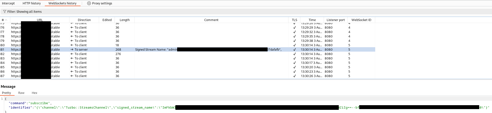

# Turbo Rails (Using the Montoya API)

__Author: Nick Coblentz__

Building this plugin was possible thanks to my employer and friends at: https://www.virtuesecurity.com

This extension annotates Web Socket messages with the name of the stream being subscribed to via [Turbo-Rails](https://www.hotrails.dev/turbo-rails/turbo-streams-security). This is important because if two users subscribe to the same stream name, they will both receive information from that channel even if they belong to different tenants.



## Download the Plugin

See the packages section on the right hand side of this Github Repo. Look for `montoyaannotateturborailssignedstreamname-x.y.z-fatjar.jar`.

## How to build this plugin

### Setup a GitHub Access Token

#### Why

Even though the Utility Package referenced by the build is public, Github still requires you to have an access token

Here's the relevant content in my `build.gradle.kts` file
```kotlin
repositories {
    mavenCentral()
    maven {
        url = uri("https://maven.pkg.github.com/ncoblentz/BurpMontoyaUtilities")
        credentials {
            username = project.findProperty("gpr.user") as String? ?: System.getenv("GHUSERNAME")
            password = project.findProperty("gpr.key") as String? ?: System.getenv("GHTOKEN")
        }
    }
}
```

```kotlin
dependencies {
    implementation("com.nickcoblentz.montoya.libraries:burpmontoyautilities:+")
```
#### What to do

1. Log into your personal github account and create an access token that can "Read Packages"
2. `export GHUSERNAME="yourusernamehere"`
3. `export GHTOKEN="youraccestokenhere"`

### Command-Line
```bash
$ ./gradlew fatJar
```
### InteliJ
1. Open the project in Intellij
2. Open the Gradle sidebar on the right hand side
3. Choose Tasks -> Other -> fatJar

## How to add this plugin to Burp
1. Open Burp Suite
2. Go to Extensions -> Installed -> Add
    - Extension Type: Java
    - Extension file: build/libs/montoyaannotateturborailssignedstreamname-x.y.z-fatjar.jar